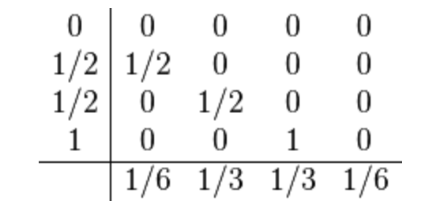

# Homework 6
### Due until 9.12., 8:30

Implement the classic fourth-order Runge-Kutta scheme

<p align="center">

</p>
to integrate the Lorenz model

<p align="center">

</p>

from *t=0* to *t=100* with the initial conditions *x(0) = 1, y(0) = 1, z(0)=1*
and *a=10, b= 28, c=8/3*.
Try different step sizes *dt* and compare the results, e.g. plot *x(t)*
for different *dt*.

You can plot the three-dimensional trajectory in gnuplot via
```
gnuplot> splot "data" u 2:3:4
```
if you have *x,y,z* stored in the second, third and fourth column, respectively, of your file. This should give you nice looking graphs, however they are not really suitable to compare results.

When you submit your code, include some nice plots of your results.
